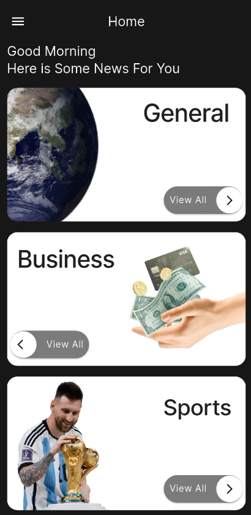
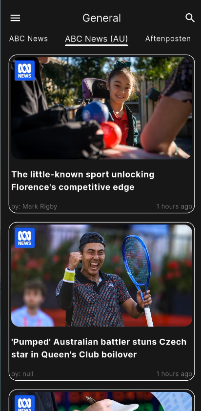
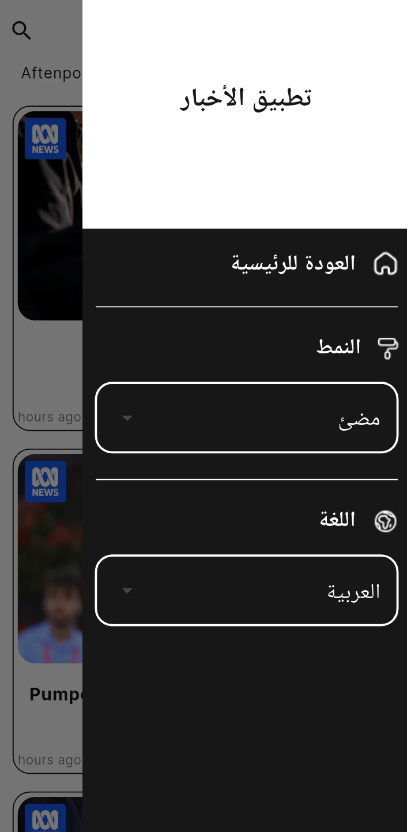

# 📰 News App — Flutter


A modern, fully localized Flutter news application that delivers real-time news headlines across multiple categories, powered by the [NewsAPI](https://newsapi.org/). The app features a clean UI with full support for **Arabic and English**, **dark and light themes**, and **search functionality** — all managed elegantly with Provider.

---

## ✨ Features

- 🌍 **Bilingual Support** — Full Arabic & English localization using Flutter's built-in `flutter_localizations` and `intl`
- 🌙 **Dark / Light Theme** — System-aware theming switchable at runtime via Provider
- 📂 **7 News Categories** — General, Business, Sports, Health, Entertainment, Technology, Science
- 🔍 **In-app Search** — Filter news articles by keyword within any category
- 🗞️ **Source-based Tabs** — Each category dynamically loads its relevant news sources as tabs
- 🖼️ **Cached Images** — Smooth image loading with `cached_network_image`
- ⏱️ **Relative Timestamps** — Human-friendly article dates powered by `timeago`
- 🔗 **Article Launch** — Open full articles in browser via `url_launcher`
- 💾 **Persistent Preferences** — Language and theme settings saved with `shared_preferences`
- 🚀 **Native Splash Screen** — Polished launch experience using `flutter_native_splash`

---

## 📸 Screenshots

| Categories (Dark Mode) | News Feed | Navigation Drawer |
| :---: | :---: | :---: |
|  |  |  |

---

## 🏗️ Architecture

The app follows a clean, scalable structure separating concerns across layers:


```

lib/
├── api/
│   ├── api_manager.dart        # HTTP requests via NewsAPI
│   └── api_constants.dart      # Base URLs, endpoints, API key
├── model/
│   ├── newsResponse.dart       # Articles & NewsResponse models
│   ├── sourceResponse.dart     # Sources & SourceResponse models
│   └── category.dart           # Category model
├── provider/
│   ├── app_theme_provider.dart    # Dark/Light theme state
│   └── app_language_provider.dart # AR/EN language state
├── ui/
│   ├── home_screen/            # Main scaffold, drawer, search bar
│   ├── category_fragment/      # Category grid/list
│   └── category_details/       # Source tabs + news list
├── l10n/                       # ARB localization files
└── utils/
├── app_colors.dart
├── app_assets.dart
└── app_text_style.dart

```

---

## 🛠️ Tech Stack

| Layer | Technology |
|---|---|
| Framework | Flutter (Dart) |
| State Management | Provider |
| Networking | `http` |
| Localization | `flutter_localizations` + `intl` |
| Image Caching | `cached_network_image` |
| Preferences | `shared_preferences` |
| Time Formatting | `timeago` |
| Link Opening | `url_launcher` |
| Fonts | `google_fonts` |
| Splash Screen | `flutter_native_splash` |
| App Icons | `flutter_launcher_icons` |

---

## 🚀 Getting Started

### Prerequisites

- Flutter SDK `>=3.0.0`
- A free API key from [newsapi.org](https://newsapi.org/)

### Installation

```bash
# 1. Clone the repository
git clone [https://github.com/ahmedmostafa361/news-app-flutter.git](https://github.com/ahmedmostafa361/news-app-flutter.git)
cd news-app-flutter

# 2. Install dependencies
flutter pub get

# 3. Add your API key
# Open lib/api/api_constants.dart and replace the placeholder:
static const String apiKey = 'YOUR_API_KEY_HERE';

# 4. Run the app
flutter run

```

---

## 🌐 API Integration

This app uses [NewsAPI.org](https://newsapi.org/) with two endpoints:

| Endpoint | Purpose |
| --- | --- |
| `/v2/top-headlines/sources` | Fetch news sources filtered by category |
| `/v2/everything` | Fetch articles filtered by source and optional search query |

Requests are built using `Uri.https()` with typed model classes (`NewsResponse`, `SourceResponse`) for clean JSON deserialization.

---

## 🌍 Localization

The app is fully localized in **Arabic** and **English**. To add a new language:

1. Add a new `.arb` file under `lib/l10n/` (e.g., `app_fr.arb`)
2. Add the locale to `supportedLocales` in `main.dart`
3. Run `flutter gen-l10n`

Language preference is persisted across sessions using `shared_preferences`.

---

## 📦 Dependencies

```yaml
dependencies:
  google_fonts: ^6.3.2
  http: ^1.5.0
  timeago: ^3.7.1
  cached_network_image: ^3.4.1
  shared_preferences: ^2.5.3
  provider: ^6.1.5+1
  url_launcher: ^6.3.2
  flutter_native_splash: ^2.4.7
  intl: any
  flutter_localizations:
    sdk: flutter

```

---

## 👨‍💻 Author

**Ahmed Mostafa Megahed**
Flutter Developer | Computer & Software Engineering Student

---

## 📄 License

This project is licensed under the MIT License — see the [LICENSE](https://www.google.com/search?q=LICENSE) file for details.

```

```
